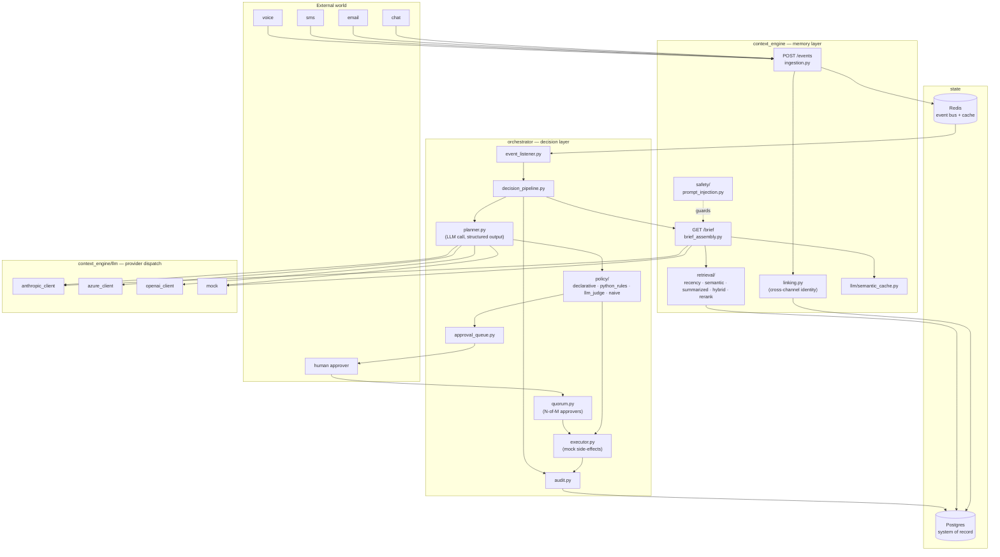
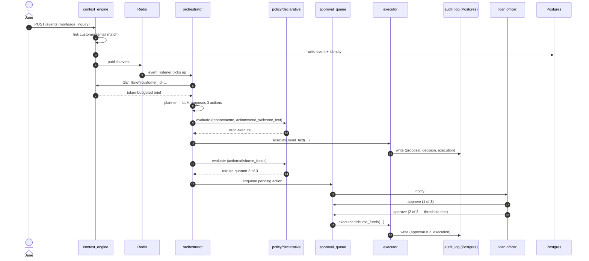
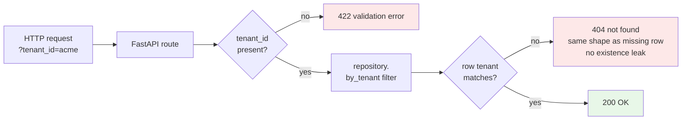
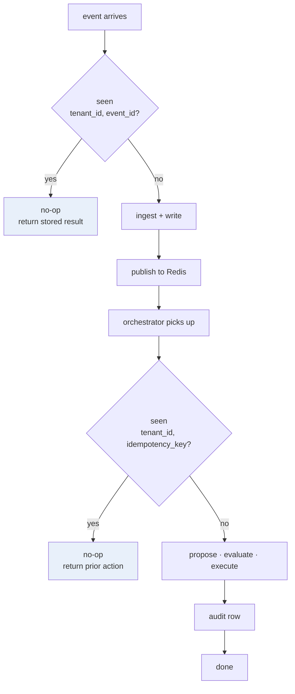
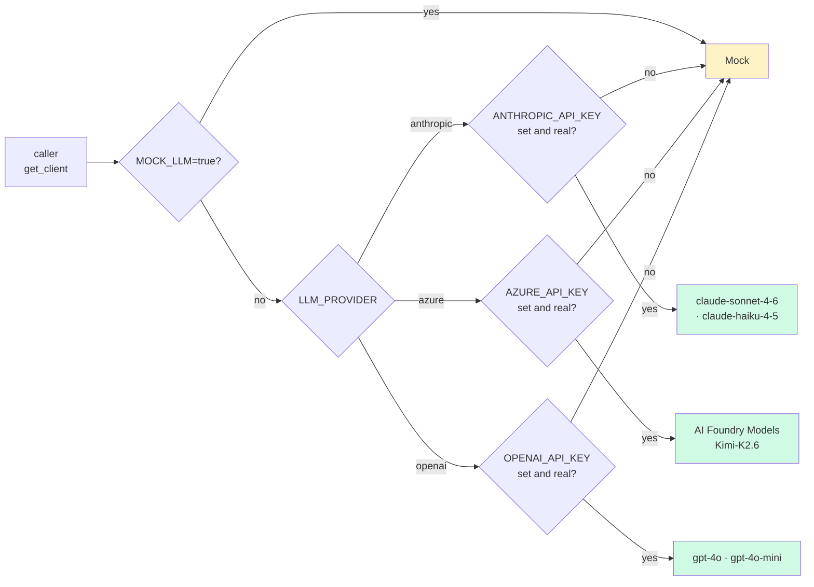
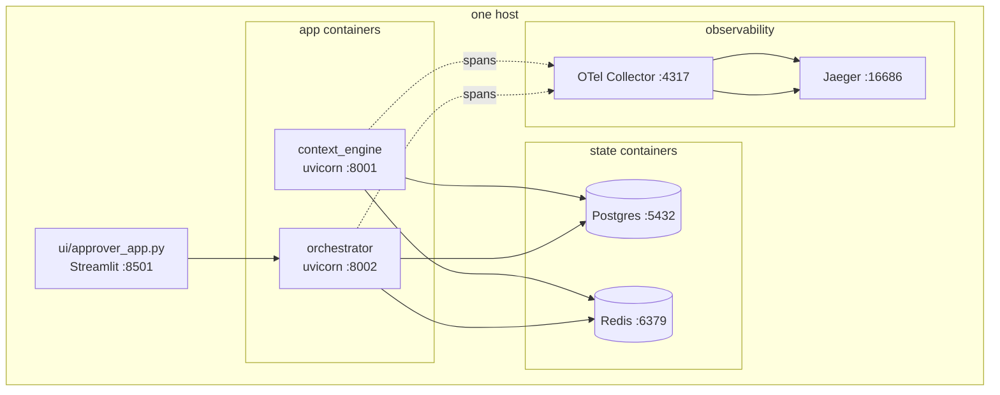
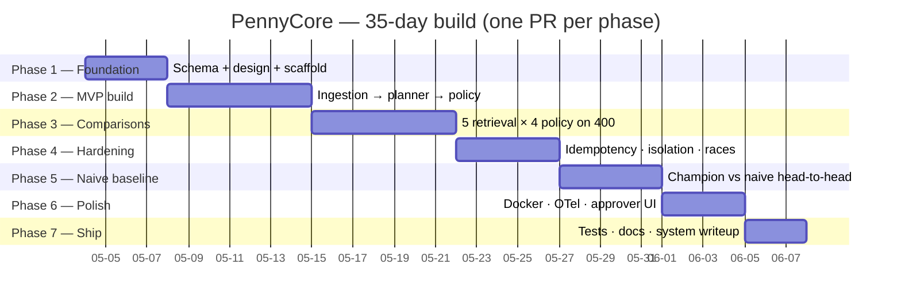

# PennyCore — Architecture (mermaid)

This is the visual companion to [docs/SYSTEM_DESIGN.md](docs/SYSTEM_DESIGN.md).
The prose source-of-truth (responsibilities, schemas, invariants, scenarios)
lives there; this file is the picture-first overview a reader can scan in
60 seconds.

> Render note: GitHub renders these blocks natively. For local preview,
> any mermaid-capable viewer (VS Code "Markdown Preview Mermaid Support",
> Obsidian, Typora) works.

---

## 1. Component map

Two services in one repo, sharing Postgres + Redis, fronted by one of four
LLM providers (Anthropic by default, Azure for the takehome adapter, OpenAI
or Mock as fallback). Tests count: **871 passed, 10 skipped** (Postgres-gated)
as of Day 33; core-package coverage **90%**.

**Reading order:** events fly in on the left, hit `context_engine` first
(memory: write to Postgres, publish to Redis, assemble a brief on demand),
then `orchestrator` picks the event off Redis, asks the LLM what to do,
runs the proposed actions through the policy engine, queues for approval
when policy demands it, executes, and audits.

---

## 2. End-to-end data flow — Jane's mortgage scenario

Three events, three actions, every state shape: auto-execute, quorum
approval, reject-then-approve. This is the canonical demo and the
`tests/integration/test_end_to_end_jane_scenario.py` happy path.

The audit log row links every action back to the originating event_id —
that's the "compliance officer can reconstruct any decision" invariant
(SYSTEM_DESIGN §5).

---

## 3. Multi-tenant isolation surface

Every read and every write scopes by `tenant_id`. Day 20 (Phase 4)
hardened the HTTP surface; the diagram below shows where the tenant
check happens at each layer.

Wrapped by `tests/integration/test_tenant_isolation.py` (15 tests across
events, customers, actions, approvals, audit, HTTP). Same-shape error on
cross-tenant access satisfies OWASP API1:2023.

---

## 4. Idempotency model

Every replay surface keys on `(tenant_id, event_id)` for ingestion and
`(tenant_id, idempotency_key)` for actions. The audit chain is
append-only so re-runs surface as additional rows, not silent
overwrites.

Wrapped by `tests/integration/test_idempotency.py` (20 tests covering
ingestion HTTP + pure, pipeline dedup, approval-queue double-decision,
audit-chain immutability, threaded races).

---

## 5. LLM provider dispatch

One env var (`LLM_PROVIDER`) flips the whole system between four
back-ends. Mock is the safe default (no keys → no surprise spend).
Every call site imports `from context_engine.llm import get_client` —
nothing reads keys directly.

The takehome adapter (`takehome/*/`) always flips to Azure regardless
of the global setting, satisfying the external scorecard's
"OpenAI-compatible API" requirement.

---

## 6. Deployment topology

Single host in development; the same compose stack lifts to a managed
host (fly.io / Railway script written but unrun in local-only mode).
OpenTelemetry traces flow to a local Jaeger collector in dev (Day 30).

Boot the whole thing with `docker-compose up`. The OTel collector is in
`docker-compose.otel.yml` so it's opt-in; production tightening lives
in `docker-compose.prod.yml`.

---

## 7. Phase-by-phase wiring (build order, locked)

---

## 8. Where the actual prose lives

| Doc | What it answers |
|-----|-----------------|
| [docs/SYSTEM_DESIGN.md](docs/SYSTEM_DESIGN.md) | Component responsibilities, schema, invariants, scenarios |
| [docs/API.md](docs/API.md) | HTTP contracts for both services |
| [docs/POLICIES.md](docs/POLICIES.md) | Tenant policy model + Phase-3 4-engine comparison |
| [docs/DEMO_SCENARIO.md](docs/DEMO_SCENARIO.md) | Jane's mortgage walkthrough, step by step |
| [docs/RESEARCH_SURVEY.md](docs/RESEARCH_SURVEY.md) | Phase-1 production-AI-infrastructure survey |
| [docs/DEMO_VIDEO_SCRIPT.md](docs/DEMO_VIDEO_SCRIPT.md) | Five-minute recorded walkthrough script |
| [context_engine/README.md](context_engine/README.md) | Memory layer — modules, public API |
| [orchestrator/README.md](orchestrator/README.md) | Decision layer — modules, public API |
| [contracts/README.md](contracts/README.md) | Shared Pydantic models + observability shims |
| [benchmarks/README.md](benchmarks/README.md) | Phase-3 / Phase-5 harness anatomy |
| [tests/README.md](tests/README.md) | Test layout + how to run subsets |
| [takehome/README.md](takehome/README.md) | External-scorecard adapter notes |

This ARCHITECTURE.md is intentionally diagram-first. If a diagram looks
wrong, the prose docs win — they are versioned alongside the code that
implements them.
