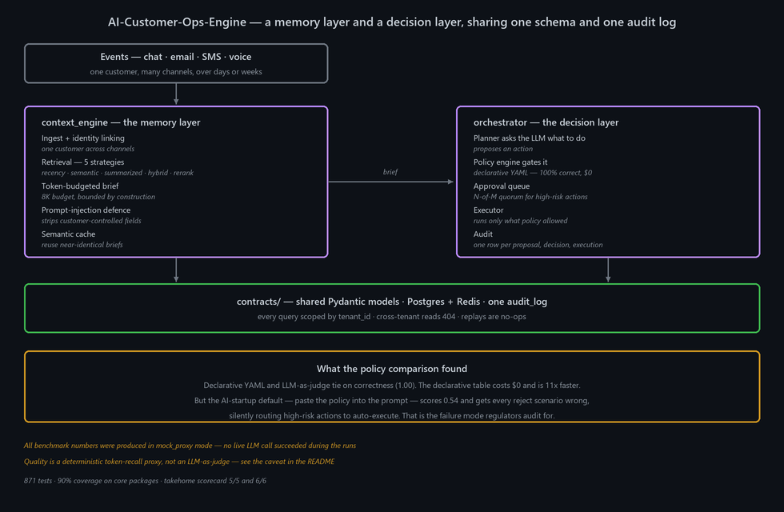

# AI-Customer-Ops-Engine

Infrastructure for customer-service AI agents in regulated industries — think a mortgage assistant that talks to a borrower across chat, email, SMS and voice over several weeks, and sometimes has to *do* something: order a valuation, waive a fee, escalate to a human.

Two services solve the two hard parts. **`context_engine`** is the memory: it links one customer across every channel and assembles a token-budgeted brief for the LLM, deciding what to include, summarise, or leave out. **`orchestrator`** is the judgement: it takes the action the LLM proposes, gates it through a tenant-specific policy, queues it for human approval when the risk demands it, executes, and writes an audit row a compliance officer can reconstruct.

Both share one schema and one audit log.

---

## Architecture



---

## Measured results

> **Read this first.** Every benchmark below ran in **`mock_proxy` mode** — no live LLM call succeeded during the runs. Token counts, latency, correctness and cost arithmetic come from real execution over the real 200-pair and 200-scenario datasets. **Quality is a deterministic token-recall proxy, not an LLM-as-judge.** The artifacts label this themselves (`"llm_mode": "mock_proxy"`), and a real-LLM re-judge was scoped but not run.

### Retrieval — the cost frontier

Nine strategies over 200 customer-history/query pairs at a fixed 8K token budget:

| | Result |
|---|---|
| Champion | **hybrid** (tiered retrieval with a bounded brief) |
| Token cost | **41% fewer brief tokens** than recency-only, in aggregate |
| Fact recall | matches recency on **183 of 200 pairs (91.5%)** |
| Quality per 1K tokens | **3.47** vs recency's 2.13 — 63% more quality per token |

The 17 losses are all in the long and very-long buckets, where the mock-mode summariser truncates by construction (`text[:200] + '...[mock-summary]'`). Under a real summariser that gap should close — but that has not been measured, so it is stated as an expectation, not a result.

Source: [`results/phase3_day18_consolidated.json`](results/phase3_day18_consolidated.json)

### Policy engines — the finding that matters

Four policy strategies over 200 event/tenant/expected-action scenarios:

| Strategy | Correctness | Cost / 100 decisions | Notes |
|---|---:|---:|---|
| **Declarative YAML (champion)** | **1.00** | **$0.00** | 0.6 µs p50; compliance can edit it without touching the engine |
| LLM-as-judge | 1.00 | $0.111 | ties on correctness, 11× slower per decision |
| **Naive-LLM (policy pasted into the prompt)** | **0.54** | — | **misses every `reject` scenario — 5 of 5 wrong** |

Two conclusions, and the second is the important one:

1. When the policy table is exact, "just ask an LLM" is **pure cost overhead** — it ties on correctness and costs money and latency.
2. The AI-startup default — pasting the policy into the prompt — doesn't just score worse. It **silently routes high-risk actions to auto-execute**, getting all five reject scenarios wrong. In a regulated setting that is the exact failure mode an auditor looks for, and it fails quietly.

LLM-as-judge is kept in the codebase for the ambiguous-policy slice a declarative table cannot enumerate.

Source: [`results/phase3_orchestrator_results.json`](results/phase3_orchestrator_results.json)

### Engineering

| | |
|---|---|
| Test suite | **871 passing**, 10 skipped (Postgres-gated) |
| Coverage | **90%** on `context_engine/` + `orchestrator/` + `contracts/` |
| External scorecard | context-engine **5/5** non-LLM · orchestrator **6/6** |

Source: [`results/takehome_scorecard.md`](results/takehome_scorecard.md)

---

## How it works

1. **Ingest** an event from any channel and link it to a customer identity that may already exist under a different handle.
2. **Assemble a brief** — pick a retrieval strategy, pull relevant history, summarise the cold tail, and stop at the token budget. The budget is enforced by construction, not by hoping.
3. **Defend the prompt** — customer-controlled fields are stripped of known injection patterns before they reach the model.
4. **Cache** — near-identical briefs are reused rather than rebuilt.
5. **Propose** — the planner asks the LLM what action to take.
6. **Gate** — the declarative policy table decides: auto-execute, require approval, or reject. The engine never asks the model whether the model's own idea was allowed.
7. **Queue** — high-risk actions wait for N-of-M human approval.
8. **Execute and audit** — one row per proposal, policy decision, approval, rejection and execution, keyed by `(tenant_id, action_id)` with a `caused_by_event_id` link.

### Guarantees, enforced by tests

- **Multi-tenant** — every query and endpoint scopes by `tenant_id`; cross-tenant access 404s with the same shape as a missing row, so existence doesn't leak.
- **Idempotent** — replaying the same `(tenant_id, event_id)` or `(tenant_id, idempotency_key)` is a no-op.
- **Auditable** — any decision can be reconstructed from `audit_log` alone.
- **Provider-agnostic** — every LLM call goes through `context_engine.llm.get_client()`; no module reads an API key directly. `MOCK_LLM=true` runs the whole system with zero keys.

## Infrastructure

| Layer | Technology |
|---|---|
| Services | `context_engine` · `orchestrator` · shared `contracts` |
| Store | Postgres (Alembic migrations) · Redis |
| API | FastAPI |
| UI | Streamlit approver app |
| Observability | OpenTelemetry shims · structured audit log |
| Packaging | Docker Compose (base, prod, OTel) |
| Tests | 871 across unit / integration / adversarial |

---

## Running locally

```bash
docker-compose up                    # Postgres + Redis + both services
pytest
./scripts/run_takehome_evals.sh      # external evaluators
streamlit run ui/approver_app.py     # approver dashboard
streamlit run ui/demo_scenario_app.py
```

Real LLM keys go in `.env` (git-ignored); without keys the system runs in `MOCK_LLM` mode. See [`.env.example`](.env.example) for the variables. Regenerate the diagram with `python assets/make_architecture.py`.

## Package documentation

[`context_engine/`](context_engine/README.md) · [`orchestrator/`](orchestrator/README.md) · [`contracts/`](contracts/README.md) · [`benchmarks/`](benchmarks/README.md) · [`tests/`](tests/README.md)
